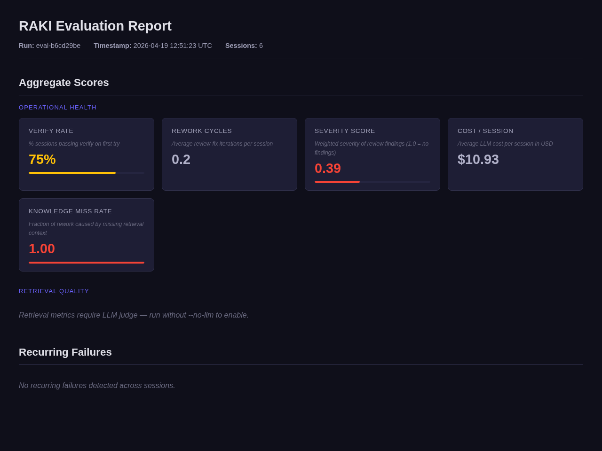

# RAKI — Retrieval Assessment for Knowledge Impact

Evaluate agentic RAG quality from session transcripts.

## Report Preview



## Install

```bash
uv sync --python 3.14 --all-extras
```

## Usage

```bash
# Run operational metrics (no LLM calls)
uv run raki run --manifest raki.yaml --no-llm

# Validate manifest and session data
uv run raki validate --manifest raki.yaml

# List available adapters
uv run raki adapters
```

## Development

```bash
# Install with dev deps
uv sync --python 3.14 --all-extras

# Run tests
uv run pytest

# Lint and format
uv run ruff check .
uv run ruff format .

# Type check
uv run ty check src/raki/
```
